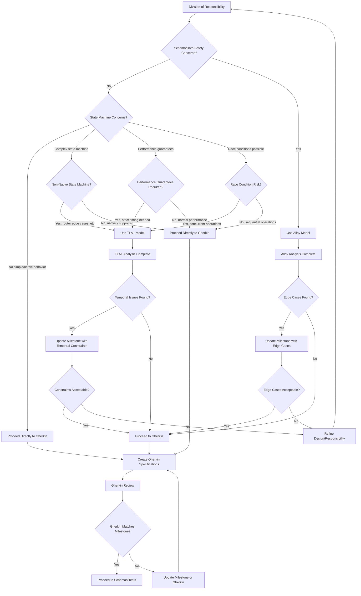

# Formal Model Decision Flow

This document defines when and how to use formal verification methods (Alloy and TLA+) in the Teja Pattern development workflow.

## 🎯 Core Principle

**Goal**: Get to Gherkin specifications that guarantee engineering implementation.
**Formal models**: Targeted tools for surfacing edge cases, not mandatory bureaucracy.

## 📊 Decision Flow Chart



## 🔍 Decision Criteria

### Alloy Model Triggers

**Use Alloy when ANY of the following apply:**

1. **Schema/Data Safety Concerns:**
   - Complex data relationships
   - Type safety between service boundaries
   - Data consistency requirements
   - Interface stability needs

2. **Structural Edge Cases:**
   - Client isolation verification
   - Resource sharing patterns
   - Configuration validation
   - Protocol conformance

### TLA+ Model Triggers

**Use TLA+ when ANY of the following apply:**

1. **State Machine Complexity:**
   - Non-native state management (custom routers, complex workflows)
   - Multi-step processes with rollback
   - Distributed state coordination

2. **Performance Guarantees:**
   - Strict timing requirements
   - Throughput guarantees
   - Latency bounds that must be proven

3. **Concurrency Concerns:**
   - Race conditions possible
   - Simultaneous operations on shared resources
   - Lock-free algorithms
   - Distributed consensus

**Skip TLA+ for:**
- Native browser behavior (window resize, standard DOM events)
- Simple request/response cycles
- Standard database operations
- Well-understood patterns

## 🔄 Feedback Loops

### Formal Model → Milestone Updates

**When formal models surface issues:**

1. **Identify the Issue:** Document the edge case or temporal problem
2. **Assess Impact:** Is this acceptable or does it require design changes?
3. **Update Milestone:** Add the constraint/edge case to milestone specifications
4. **Decision Point:** Proceed with current design or refine responsibilities?

### Milestone → Formal Model Updates

**When milestones are refined:**

1. **New Requirements:** May trigger formal model re-analysis
2. **Updated Constraints:** May require new verification rounds
3. **Changed Responsibilities:** May affect structural properties

## 📋 Required Artifacts

### When Alloy is Used

1. **Alloy Model:** `/docs/architecture/vX.Y/alloy/[feature].als`
2. **Analysis Results:** Document findings and edge cases
3. **Milestone Updates:** Add any structural constraints discovered

### When TLA+ is Used

1. **Alloy Types:** Always include supporting Alloy types even if boilerplate
2. **TLA+ Model:** `/docs/architecture/vX.Y/tla/[feature].tla`
3. **Temporal Analysis:** Document timing/race condition findings
4. **Milestone Updates:** Add any temporal constraints discovered

## 🎯 Success Criteria

### Formal Model Success

**Alloy Success Indicators:**
- ✅ No structural contradictions found
- ✅ All edge cases documented and understood
- ✅ Data relationships validated
- ✅ Interface contracts proven consistent

**TLA+ Success Indicators:**
- ✅ No deadlock/livelock scenarios
- ✅ Performance bounds verified
- ✅ Race conditions eliminated or documented
- ✅ Temporal properties proven

### Gherkin Success

**All paths must end with:**
- ✅ Gherkin specifications that guarantee implementation
- ✅ Scenarios cover all identified edge cases
- ✅ Behavior matches milestone requirements exactly
- ✅ Clear mapping from formal model findings to test scenarios

## 🚀 Practical Examples

### Example 1: Simple CRUD Feature
```
Division of Responsibility → No schema concerns → No state machine concerns
→ Proceed directly to Gherkin
```

### Example 2: Multi-User Resource Sharing
```
Division of Responsibility → Schema concerns (data safety) → Use Alloy
→ Analyze client isolation → Update milestone with sharing constraints
→ Proceed to Gherkin
```

### Example 3: Custom Frontend Router
```
Division of Responsibility → No schema concerns → Complex state machine
→ Non-native behavior → Use TLA+ (with Alloy types)
→ Analyze routing edge cases → Update milestone with routing guarantees
→ Proceed to Gherkin
```

### Example 4: Real-time Collaboration
```
Division of Responsibility → Schema concerns + state machine concerns
→ Use Alloy first → Analyze data consistency → Use TLA+ for concurrency
→ Update milestone with collaboration constraints → Proceed to Gherkin
```

## 📝 Quick Reference Checklist

### Before Using Formal Models:
- [ ] What are the specific concerns driving this need?
- [ ] Are there simpler ways to validate these concerns?
- [ ] Will the formal model results change implementation decisions?

### When Creating Models:
- [ ] Alloy: Focus on structure and relationships
- [ ] TLA+: Always include supporting Alloy types
- [ ] Document assumptions clearly
- [ ] Expected vs. actual findings

### After Model Analysis:
- [ ] All findings documented
- [ ] Edge cases assessed for acceptability
- [ ] Milestone updated if needed
- [ ] Clear path to Gherkin established